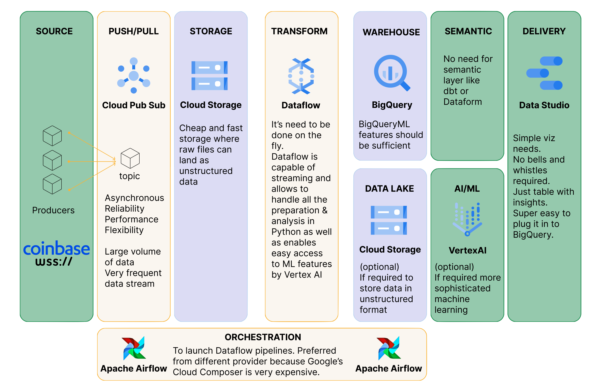

# Cryptoinsights
This repo contains simple CLI app that connect to public [Coinbase Market
Data](https://docs.cloud.coinbase.com/exchange/docs/websocket-overview)
Websocket feed. You don't need to authenticate with Coinbase API key to
use it.

## Setup
```bash
git clone https://github.com/bogumilo/dockerbogumilo/cryptoinsights && cd cryptoinsights
```
Python environment:
```bash
pynev virtualenv 3.9.12 env
pyenv activate env
pip install -r requirements.txt
```

 ## Run script to get real-time insights in CLI
```py
python solutions.py
```

Choose BTC-USD when prompted. This start to ingest data from WebSocket to data.csv in the background.
Leave it for a couple of minutes to have the most accurate data.

Insights consist of:
- current  `highest_bid` and `lowest_ask` from the order book with their `quantity`
- largest `difference` between them so far
-  `mid_price` in the last 1, 5, 15 min


# Infrastructure diagram

